<div align="center">

# DealFlow360

**End-to-End Sales Operations — From Requirement to Payment**

*Odoo Hackathon · Team THE BOYS*

[](#-hackathon-requirement-coverage)
[](#️-frontend)
[](#-backend)
[](#-odoo-integration)

DealFlow360 is an intelligent sales-operations platform that connects the complete B2B deal
lifecycle — requirement, quotation, pricing, discount governance, approval, negotiation,
fulfillment, billing, and payment — into a single, governed, and traceable workflow.

</div>

> **Design principle:** critical business rules are enforced by backend/application logic,
> not merely displayed by the frontend. The UI reflects state; it does not decide it.

> **Note:** *Customer Requirement → Quotation* is a product enhancement on top of the core
> quote-to-cash workflow. A customer describes what they need first; a Sales Executive then
> converts that requirement into a formal quotation.

---

## 📋 Table of Contents

<table>
<tr>
<td valign="top">

**Overview**
- [Problem Statement](#-problem-statement)
- [Solution Overview](#-solution-overview)
- [End-to-End Workflow](#-end-to-end-workflow)
- [Customer Requirement Flow](#-customer-requirement-flow)
- [Why DealFlow360](#-why-dealflow360)
- [Business Value](#-business-value)

**Product**
- [Core Features](#️-core-features)
- [Module Overview](#️-module-overview)
- [Business Rules](#-business-rules)
- [Quotation State Machine](#-quotation-state-machine)

</td>
<td valign="top">

**Engineering**
- [Frontend](#️-frontend)
- [Backend](#-backend)
- [Odoo Integration](#-odoo-integration)
- [Architecture](#️-architecture)
- [Data Models](#️-data-models)
- [API Documentation](#-api-documentation)
- [Project Structure](#-project-structure)

**Operate**
- [Setup & Installation](#-setup--installation)
- [Environment Variables](#-environment-variables)
- [Development Workflow](#-development-workflow)
- [Testing & Validation](#-testing--validation)
- [Security & Access Control](#-security--access-control)

</td>
<td valign="top">

**Ship it**
- [Hackathon Demo Flow](#-hackathon-demo-flow)
- [Technical Highlights](#-technical-highlights)
- [Requirement Coverage](#-hackathon-requirement-coverage)
- [Future Roadmap](#️-future-roadmap)
- [Team](#-team-the-boys)
- [Acknowledgement](#-acknowledgement)

</td>
</tr>
</table>

---

## 🎯 Problem Statement

Traditional sales systems handle quotation, approvals, inventory, billing, and customer
communication as **disconnected processes**. In practice, this creates:

- Unauthorized or inconsistent discounts
- Slow, opaque approval cycles
- Little visibility into quotation margins
- Missed upsell and cross-sell opportunities
- Difficult multi-warehouse fulfillment
- Incorrect handling of recurring vs. one-time billing
- Complex subscription changes and proration
- Customer negotiation happening *outside* the core workflow
- No visibility into stalled or unhealthy deals
- Poor traceability of important commercial changes

DealFlow360 addresses this by connecting the complete sales lifecycle into one workflow.

### Key challenges addressed

| Challenge | DealFlow360 Approach |
|---|---|
| Discount governance | Tier- and category-based discount rules |
| Approval delays | Automated approval routing |
| Pricing | Customer-specific pricing and price lists |
| Upselling | Contextual product recommendations |
| Margin visibility | Real-time margin impact |
| Risk | Deal Guardian and blended risk analysis |
| Fulfillment | Multi-warehouse allocation |
| Billing | One-time + recurring billing |
| Subscription changes | Proration-aware billing |
| Negotiation | Dedicated customer portal |
| Re-approval | Automatic re-evaluation after changes |
| Deal monitoring | Deal Health dashboard |
| Traceability | Audit trail |
| Analytics | Reporting and operational insights |

---

## 💡 Solution Overview

DealFlow360 is not just a quotation builder. It turns a fragmented sales process into a
**connected workflow**, where quotation, pricing, discount decisions, approvals, customer
negotiation, fulfillment, billing, and payment stay linked throughout the deal lifecycle.

<table>
<tr>
<th width="20%">Role</th>
<th>Can do</th>
</tr>
<tr>
<td><strong>🧑‍💼 Customer</strong></td>
<td>Submit requirements · view quotations · negotiate · request line-level changes · counter discounts · confirm quotations · view invoices · manage subscriptions · track payment status</td>
</tr>
<tr>
<td><strong>💼 Sales Executive</strong></td>
<td>View assigned requirements · convert requirements into quotations · add products/services/subscriptions · apply discounts · review pricing & margin · view upsell/cross-sell suggestions · submit for approval · track status</td>
</tr>
<tr>
<td><strong>✅ Sales Manager</strong></td>
<td>Review quotations, discount violations, and blended risk · approve / reject / return · review audit history</td>
</tr>
<tr>
<td><strong>💰 Finance / Operations</strong></td>
<td>Participate in approval when required · handle invoices and billing · track payment status · support fulfillment & billing workflows</td>
</tr>
<tr>
<td><strong>🛠️ Administrator</strong></td>
<td>Manage products, price lists, discount rules, subscription plans, warehouses, users, customers, reports & analytics</td>
</tr>
</table>

---

## 🔄 End-to-End Workflow

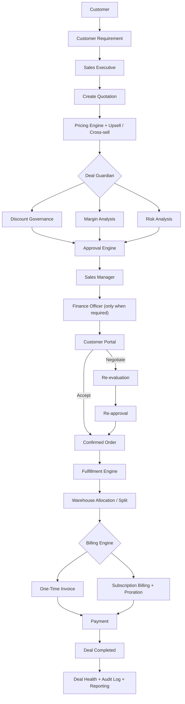

### Workflow explanation

1. **Customer Requirement** — the customer describes what they need instead of directly creating a commercial quotation.
2. **Sales Executive** — the assigned executive reviews the requirement and creates the formal quotation.
3. **Pricing & Upsell** — products, services, subscriptions, customer pricing, and relevant upsell/cross-sell opportunities are evaluated.
4. **Deal Guardian** — the quotation is evaluated for discount governance, margin impact, and commercial risk.
5. **Approval** — quotations crossing configured thresholds are routed through the appropriate approval chain.
6. **Customer Negotiation** — the customer receives the quotation through a restricted portal and can request changes or counter the discount.
7. **Re-evaluation** — negotiated changes are re-evaluated; exceeding thresholds triggers approval again.
8. **Fulfillment** — products are allocated across warehouses based on availability.
9. **Billing** — one-time products and recurring subscription lines follow their respective billing schedules.
10. **Payment & Completion** — payment status is tracked as the deal progresses to completion.
11. **Deal Health & Audit** — the system retains visibility into stalled deals, anomalies, changes, and key business events.

---

## 📝 Customer Requirement Flow

*Customer Requirement* is a product enhancement that sits **before** quotation creation.

**Example**

> ABC Manufacturing needs **10 laptops**, installation service, and 1-year support.
> Expected delivery: **15 days** · Priority: **HIGH**

The customer submits this requirement, and the system creates:

```
REQ-001
Status: NEW
```

The requirement is assigned to a Sales Executive, who opens it and selects **Create Quotation**,
creating the relationship:

```
REQ-001 ──► Q-1042
```

The quotation retains the original `requirementId`.

### Requirement lifecycle

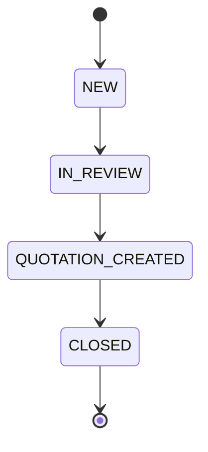

### API contract

**`POST /requirements`**

```json
{
  "customerId": "customer-id",
  "title": "Laptop and Support Requirement",
  "description": "10 laptops with installation and one-year support",
  "items": [],
  "expectedDeliveryDays": 15,
  "priority": "HIGH",
  "additionalNotes": "Required for new employees"
}
```

> Customer identity should be derived from the **authenticated session**, never accepted
> as a client-supplied `customerId`, to prevent one customer impersonating another.

Sales Executives access their assigned requirements via:

```
GET /requirements?assignedTo=me
```

---

## ⚙️ Core Features

### 🔐 Authentication & role-based access

Distinct experiences for **Customer**, **Sales Executive**, **Sales Manager**, **Finance
Officer**, and **Administrator** — each scoped to the workflows relevant to their role.

### 🏷️ Customer tier management

| Tier | Discount ceiling |
|---|---:|
| 🥉 Bronze | 5% |
| 🥈 Silver | 10% |
| 🥇 Gold | 15% |

**Rules:**
- Tier is **system-managed** — customers never select their own tier.
- Tier and Subscription are **separate concepts**.
- Gold customers **do not** automatically bypass approval.
- Tiers can be promoted/demoted based on business activity and usage.

### 💰 Pricing & discount governance

Considers customer tier, product/category, line- and order-level discounts, discount
ceilings, approval requirements, blended risk, and audit history.

**Example — Gold customer, max tier discount 15%**

| Category | Category limit | Applied | Result |
|---|---:|---:|---|
| Hardware (Laptop) | 15% | 12% | ✅ Within limit |
| Services (Setup) | 10% | 18% | 🚩 Exceeds limit → **flagged, approval required** |

> Mixed-category quotations are evaluated using blended/highest-risk logic.

### 📈 Upsell & cross-sell

Signals: product pairings, historical co-purchase patterns, promoted products, and
minimum margin thresholds. Each suggestion surfaces:

`Recommended product` · `Reason` · `Promotion indicator` · `Margin delta` · `Add` · `Dismiss`

Adding a recommendation immediately updates quotation totals and margin impact.

### 🛡️ Deal Guardian

The commercial-control layer of DealFlow360 — combines **Discount Governance**, **Margin
Analysis**, and **Risk Analysis** so Sales Executives and approvers can judge whether a
quotation is commercially healthy before it progresses.

### ✅ Approval Engine

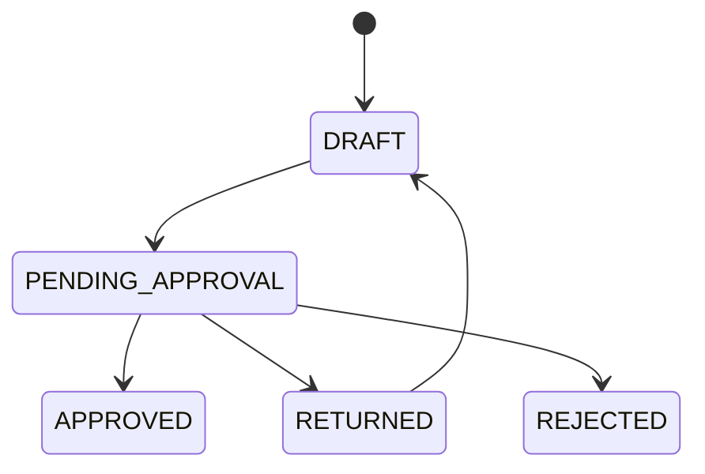

Decisions: **Approve** · **Reject** · **Return for changes**. Finance approval is triggered
only when configured rules require it.

### 🤝 Customer negotiation

Through a dedicated, restricted portal, customers can view the quotation, comment on
individual lines, request changes, counter discounts, submit negotiation requests, and
confirm the quotation.

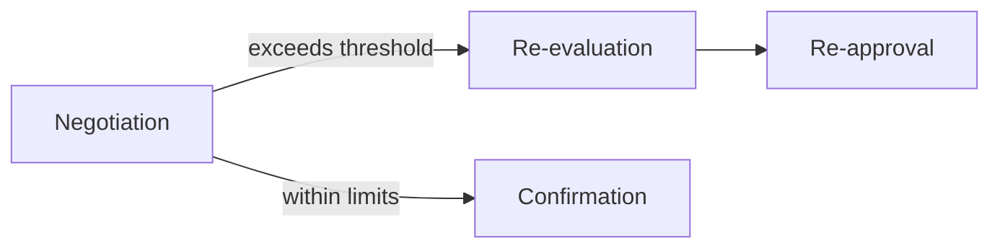

### 📦 Fulfillment

Supports warehouse stock visibility, recommended allocation, multi-warehouse splitting,
shipment count, fulfillment cost, manual override, consolidation suggestions, and
backorders where applicable.

**Example**

```
Order: 10 Laptops
  Warehouse A → 6
  Warehouse B → 4
```

### 🔄 Subscription & billing

A hybrid billing model combining **one-time** (hardware, installation, professional
services) and **recurring** (monthly, quarterly, yearly) lines within a single quotation.

**Subscription lifecycle:** Subscribe · Skip · Upgrade · Downgrade · Pause · Resume · Cancel
*(independent of customer tier changes)*

**Proration**, conceptually:

```
Unused value from existing plan
        + Charge for new plan for remaining period
        = Net billing adjustment
```

> Calculated from the actual remaining billing period, not a fixed value.

### 🧾 Invoice & payment

Tracks invoice status, one-time invoices, subscription billing, payment tracking, and
payment status, preserving the chain:

```
Quotation ──► Order ──► Invoice ──► Payment
```

### ❤️ Deal Health

Surfaces stalled quotations, discount anomalies, delivery slippage, approval delays, risk
alerts, and escalations/nudges — a proactive view of deals needing attention.

### 📜 Audit trail

Traceable history of discount edits, approval decisions, negotiation changes, quote
changes, state transitions, and other key commercial events.

---

## 🖥️ Frontend

Built on the project's existing **Next.js / React** architecture.

**Responsibilities:** role-based interfaces · customer portal · sales workspace · quote
builder · approval interfaces · fulfillment interfaces · billing interfaces · Deal Health ·
administrative configuration.

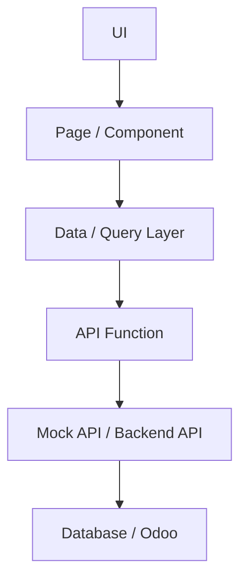

The API abstraction lets the frontend run on mock services first, then switch to the real
backend without a UI rewrite.

**Principles:** component-based architecture · reusable UI · role-based navigation · API
abstraction · form validation · responsive enterprise UI · clear business-state indicators ·
minimal unnecessary animation · business-rule visibility.

---

## 🧠 Backend

Owns core business logic and data operations: authentication, authorization, customer
isolation, requirements, quotations, discount rules, approval routing, risk evaluation,
fulfillment, billing, subscriptions, payments, audit logging, and Odoo integration.

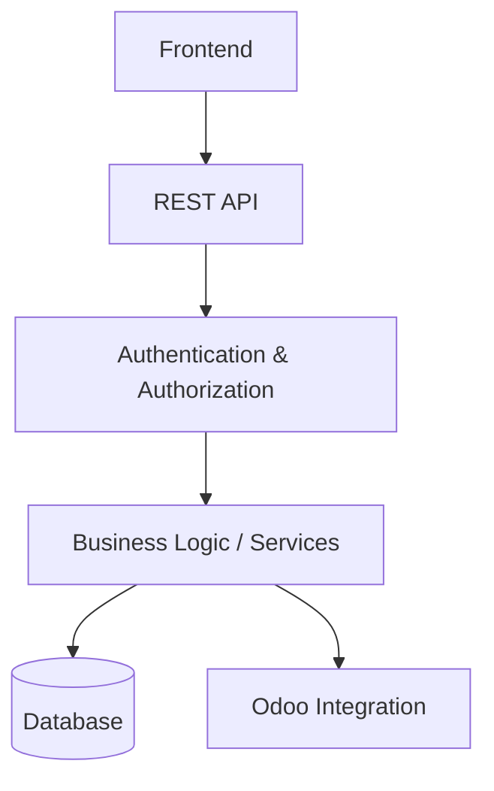

> Critical business rules are enforced **on the server**, not relied upon from the frontend alone.

---

## 🟣 Odoo Integration

DealFlow360 is designed to work with **Odoo** as part of the surrounding ERP ecosystem.

| Area | Purpose |
|---|---|
| Customers | Customer records |
| Products | Product information |
| Price Lists | Pricing |
| Sales Orders | Confirmed orders |
| Invoices | Accounting |
| Payments | Payment status |
| Subscriptions | Recurring billing |
| Inventory | Warehouse stock |
| Users / Roles | Access control |

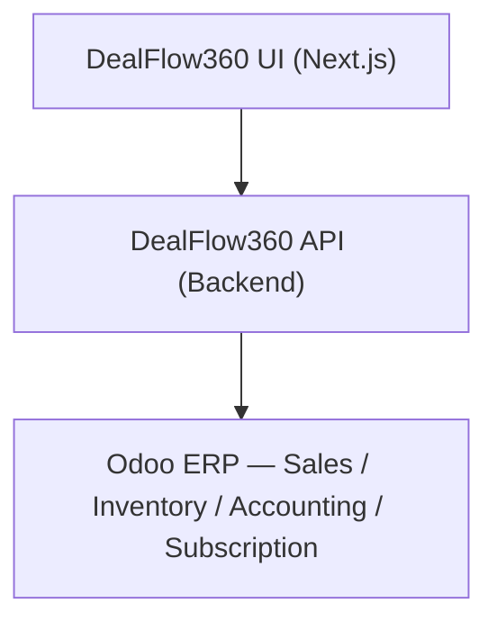

> Odoo capabilities are marked **Implemented**, **Integration-ready**, or **Planned**
> according to the current backend implementation. Nothing is labeled *implemented* unless
> the corresponding connector/API actually exists.

---

## 📐 Business Rules

### Discount rules

| Tier | Ceiling |
|---|---:|
| Bronze | 5% |
| Silver | 10% |
| Gold | 15% |

| Category | Ceiling |
|---|---:|
| Hardware | 15% |
| Services | 10% |

> The **effective maximum discount** respects both the customer-tier ceiling and the
> category-level ceiling — whichever is more restrictive applies.

### Approval rules

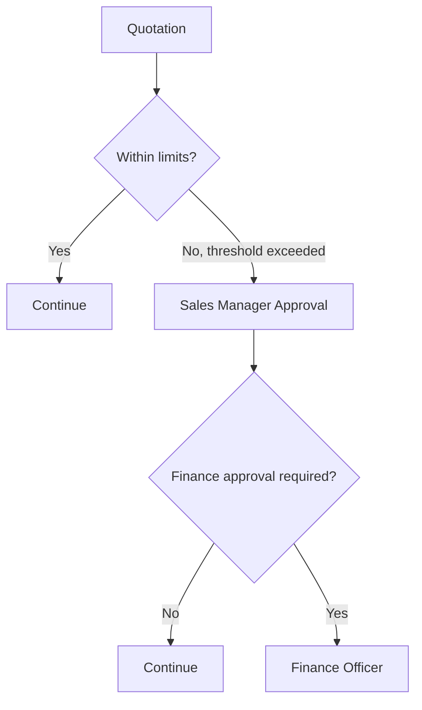

### Negotiation rules

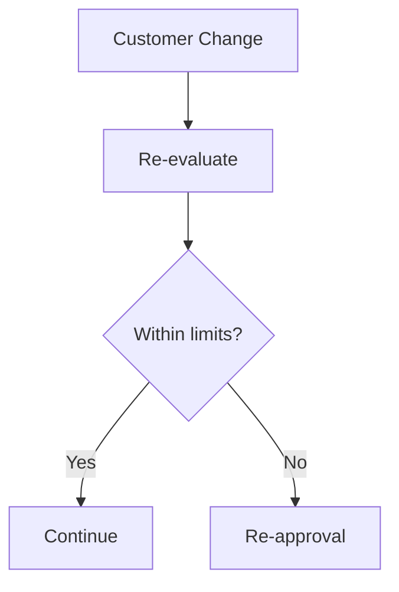

### Customer tier

- System-managed
- Independent of subscription
- Not customer-selected

### Subscription lifecycle

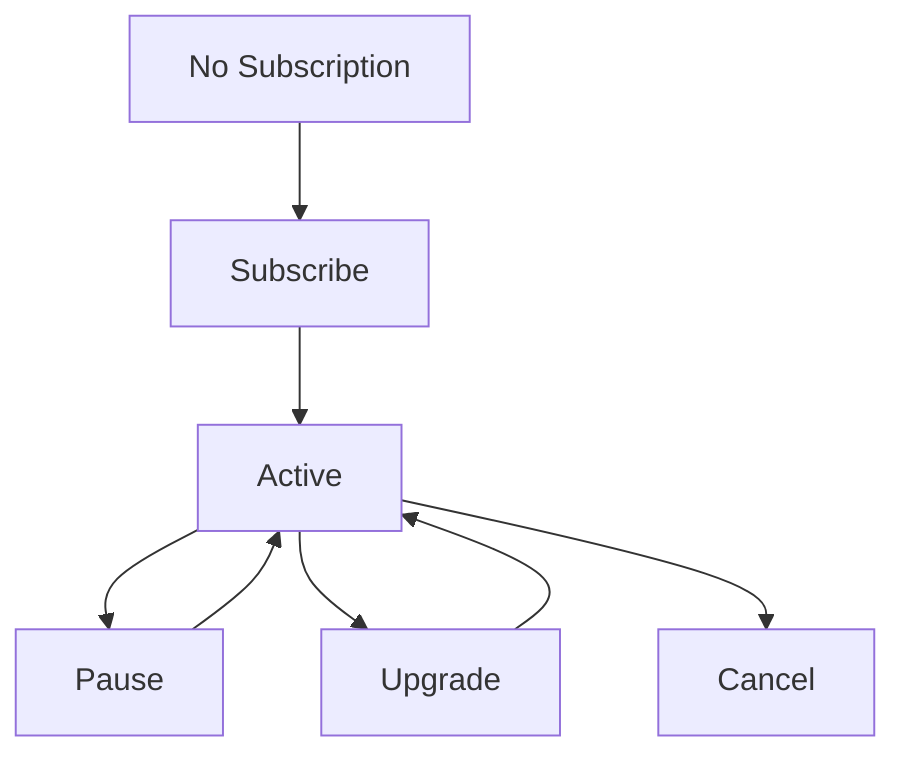

---

## 🔁 Quotation State Machine

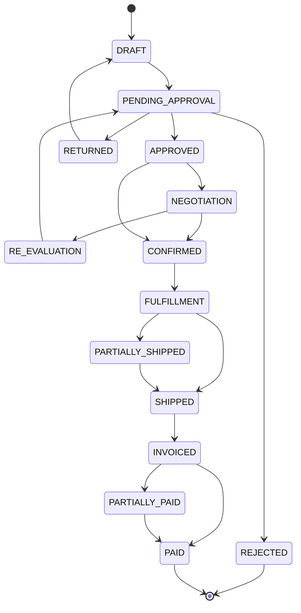

---

## 🔌 API Documentation

> Endpoints below reflect the current implementation state. Mock/planned endpoints are
> explicitly labeled — none are presented as production APIs unless they are.

### Requirement APIs

| Method | Endpoint | Purpose |
|---|---|---|
| `POST` | `/requirements` | Create a customer requirement |
| `GET` | `/requirements?assignedTo=me` | Retrieve requirements assigned to the current Sales Executive |

**`POST /requirements`** — used when a customer submits a new requirement:

```json
{
  "customerId": "customer-id",
  "title": "Laptop Requirement",
  "description": "10 laptops with installation and support",
  "items": [],
  "expectedDeliveryDays": 15,
  "priority": "HIGH",
  "additionalNotes": "Required within 15 days"
}
```

Additional endpoints should be documented here as they are implemented.

---

## 🗃️ Data Models

Core entities: `User` · `Customer` · `Requirement` · `Quotation` · `QuotationLine` ·
`Product` · `PriceList` · `DiscountRule` · `Approval` · `Warehouse` · `Fulfillment` ·
`Subscription` · `Invoice` · `Payment` · `AuditEvent` · `DealHealthAlert`

### Requirement

```
id
customerId
title / description
priority
expectedDeliveryDays
status
assignedSalesExecutiveId
createdAt
updatedAt
```

**Example**

```json
{
  "id": "REQ-001",
  "customerId": "CUST-001",
  "priority": "HIGH",
  "expectedDeliveryDays": 15,
  "status": "NEW",
  "assignedSalesExecutiveId": "SE-001"
}
```

---

## 📁 Project Structure

```
DealFlow360/
├── frontend/
│   ├── app/
│   ├── components/
│   ├── hooks/
│   ├── lib/
│   ├── services/
│   ├── types/
│   └── ...
├── backend/
│   ├── ...
│   └── ...
├── README.md
└── ...
```

> Exact structure may differ between the frontend and backend repositories.

---

## 🚀 Setup & Installation

### Prerequisites

- Node.js
- npm (or the package manager used by the project)
- Backend runtime, database, and an Odoo instance (when Odoo integration is enabled)

### Frontend

```bash
npm install        # install dependencies
npm run dev         # start the development server
npm run build        # build for production
npm run lint          # run linting, if configured
```

### Backend

```bash
<backend-install-command>       # install dependencies
<backend-development-command>    # start development server
```

> Replace placeholders with actual backend commands once the backend repository is finalized.

### Odoo

When the Odoo connector is enabled, configure the Odoo instance, version, required modules,
API/RPC settings, authentication credentials, and connection environment variables.

---

## 🔑 Environment Variables

> Never commit real credentials to the repository. Use `.env.example` files as templates.

| Variable | Purpose | Required |
|---|---|---|
| `NEXT_PUBLIC_API_URL` | Backend API URL | Depends on setup |
| `DATABASE_URL` | Database connection | Backend dependent |
| `ODOO_URL` | Odoo server URL | If integrated |
| `ODOO_DB` | Odoo database | If integrated |
| `ODOO_USERNAME` | Odoo integration user | If integrated |
| `ODOO_PASSWORD` | Odoo integration password | If integrated |

**Never commit:** passwords · API keys · tokens · database credentials · private URLs · production secrets

---

## 🔧 Development Workflow

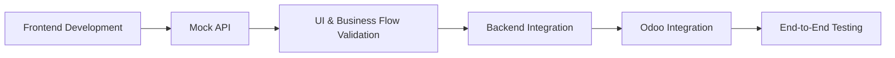

The API abstraction layer lets mock implementations be swapped for real backend APIs
without destabilizing the frontend architecture.

---

## 🎬 Hackathon Demo Flow

*A ~5-minute judge walkthrough of the most important business rules.*

| # | Step | What it shows |
|---:|---|---|
| 1 | **Login** | Role-based authentication |
| 2 | **Customer Requirement** | Customer submits: 10 laptops + installation + 1-year support, 15-day delivery, HIGH priority |
| 3 | **Sales Executive** | Opens `REQ-001`, selects **Create Quotation** |
| 4 | **Quote Builder** | `REQ-001 → Q-1042`, adds products/services/subscription |
| 5 | **Pricing & Margin** | Customer pricing, discount, total, margin impact |
| 6 | **Deal Guardian** | Discount above threshold → violation + risk + approval required |
| 7 | **Approval** | Sales Manager approves/rejects/returns; Finance only if required |
| 8 | **Customer Negotiation** | Customer counters the discount via the portal |
| 9 | **Re-evaluation** | Changed terms trigger re-approval |
| 10 | **Confirmation** | Customer confirms the quotation |
| 11 | **Fulfillment** | Warehouse split: A → 6, B → 4 |
| 12 | **Billing** | One-time invoice + recurring subscription |
| 13 | **Payment** | Invoice/payment status |
| 14 | **Deal Health** | Discount anomaly, approval history, audit trail |

---

## 🏆 Technical Highlights

Role-based access control · modular frontend architecture · API abstraction · customer
isolation · discount governance · approval workflow · blended risk analysis · margin
visibility · upsell/cross-sell · customer negotiation · multi-warehouse fulfillment ·
subscription billing · proration · invoice/payment workflow · audit logging · deal
analytics · Odoo integration readiness.

> Implementation status varies across frontend, backend, and Odoo integration.

---

## 🔒 Security & Access Control

**Customer isolation** — a customer can access only their own requirements, quotations,
invoices, subscriptions, and payment information.

**Authentication** — user identity is established through the authenticated session.

**Authorization** — the backend validates that the user may perform the requested operation.

**Customer ID** — derived from authenticated context, never trusted from a client-supplied value.

**Server-side validation** — critical business rules are enforced on the backend; frontend
validation improves UX but is **not** a security boundary.

---

## 🧪 Testing & Validation

Coverage should include unit testing, API testing, integration testing, frontend testing,
business-rule validation, and build/type checking. Run before deploying:

```bash
npm run build
npm run lint
```

> Additional commands should be documented according to the actual project configuration.

---

## 📊 Hackathon Requirement Coverage

**Legend:** ✅ Implemented &nbsp;·&nbsp; 🟡 Partial / integration-ready &nbsp;·&nbsp; 🔵 Planned

| Requirement | DealFlow360 Solution | Status |
|---|---|:---:|
| Authentication | Role-based login/access | 🟡 |
| Product / Price List | Product and pricing management | 🟡 |
| Customer Tiers | Bronze / Silver / Gold governance | 🟡 |
| Discount Governance | Tier + category discount limits | 🟡 |
| Approval Routing | Sales Manager / Finance routing | 🟡 |
| Blended Risk | Deal Guardian risk evaluation | 🟡 |
| Upsell / Cross-sell | Product recommendations | 🟡 |
| Margin Impact | Real-time quotation margin visibility | 🟡 |
| Warehouse Splitting | Multi-warehouse fulfillment | 🟡 |
| Subscription Billing | Recurring billing | 🟡 |
| Proration | Mid-cycle subscription adjustment | 🟡 |
| Customer Portal | Restricted customer experience | 🟡 |
| Negotiation | Counter discounts / line changes | 🟡 |
| Re-approval | Re-evaluation after negotiation | 🟡 |
| Deal Health | Stalled/anomaly/risk monitoring | 🟡 |
| Audit Trail | Business event history | 🟡 |
| Reporting | Deal and operational reporting | 🟡 |
| Odoo Integration | ERP integration layer | 🟡 |

> Status should be updated as backend and Odoo integration are completed.

---

## 🗺️ Future Roadmap

<table>
<tr><td width="25%" valign="top">

**Phase 1**
Backend Integration
</td><td>

Connect frontend to production backend APIs · replace mock services · complete
end-to-end authentication · complete server-side business rules

</td></tr>
<tr><td valign="top">

**Phase 2**
Odoo Integration
</td><td>

Customer, product, and price-list synchronization · sales order integration ·
inventory synchronization · invoice integration · payment synchronization ·
subscription integration

</td></tr>
<tr><td valign="top">

**Phase 3**
Advanced Intelligence
</td><td>

Advanced deal-risk detection · improved sales forecasting · smarter recommendations ·
advanced analytics · automated anomaly detection

</td></tr>
<tr><td valign="top">

**Phase 4**
Customer Intelligence
</td><td>

Advanced customer scoring · automated escalation · customer behavior insights ·
intelligent subscription lifecycle management

</td></tr>
</table>

---

## 🌟 Why DealFlow360?

DealFlow360 connects **pricing + discount governance + margin analysis + risk + approval +
negotiation + fulfillment + billing + payment + deal health** into one workflow — so a
commercial decision made during quotation creation stays connected through approval,
negotiation, fulfillment, billing, and payment.

## 🏗️ Architecture

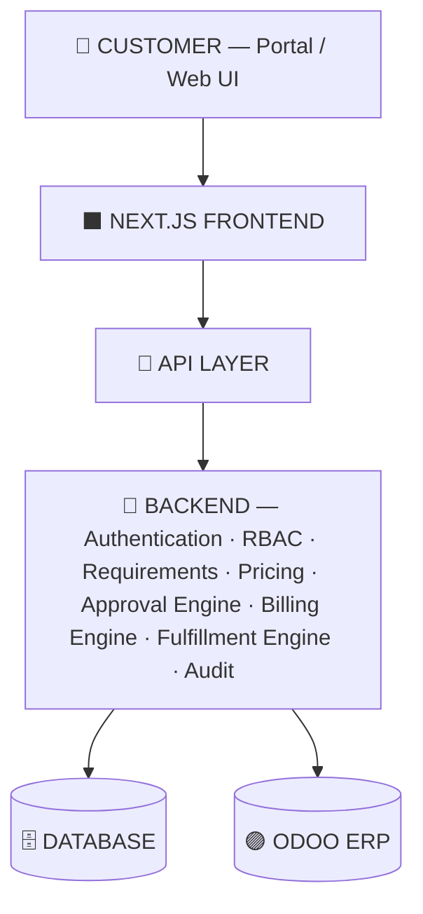

## 🖥️ Module Overview

<table>
<tr><th>Customer</th><th>Sales Executive</th><th>Sales Manager</th><th>Finance</th><th>Admin</th></tr>
<tr valign="top">
<td>

- Portal Dashboard
- Requirements
- Quotations
- Invoices
- Subscriptions
- Profile

</td>
<td>

- Dashboard
- Customer Requirements
- Quote Builder
- Quotations
- Customers
- Fulfillment
- Deal Health

</td>
<td>

- Dashboard
- Approval Queue
- Risk Analysis
- Deal Health

</td>
<td>

- Dashboard
- Approvals
- Invoices
- Payments
- Subscriptions

</td>
<td>

- Dashboard
- Products
- Price Lists
- Customers
- Users
- Discount Rules
- Subscription Plans
- Warehouses
- Reports

</td>
</tr>
</table>

## 📈 Business Value

Reduce approval delays · prevent unauthorized discounts · protect margins · improve
upsell/cross-sell · reduce fulfillment errors · handle mixed billing correctly · improve
customer negotiation · identify stalled deals · detect discount anomalies · maintain a
traceable audit history · connect Sales, Operations, Finance, and Customers.

> Governed automation — not just digitized sales screens.

---

## 👥 Team THE BOYS

| Member | Role | Responsibility |
|---|---|---|
| **Divyansh Mishra** | Team Lead | Frontend development · team coordination & management · product workflow coordination |
| **Yash Raj Srivastava** | UI & Frontend | UI/UX · frontend implementation · user experience |
| **Ayushman Yadav** | Backend | Backend development · APIs · business logic |
| **Saksham Kumar** | Backend | Backend development · APIs · data & integration work |

---

## 🏁 Acknowledgement

<div align="center">

Built for the **Odoo Hackathon** by **Team THE BOYS**

**DealFlow360** — *From Customer Requirement to Payment. One Connected Deal.*

</div>